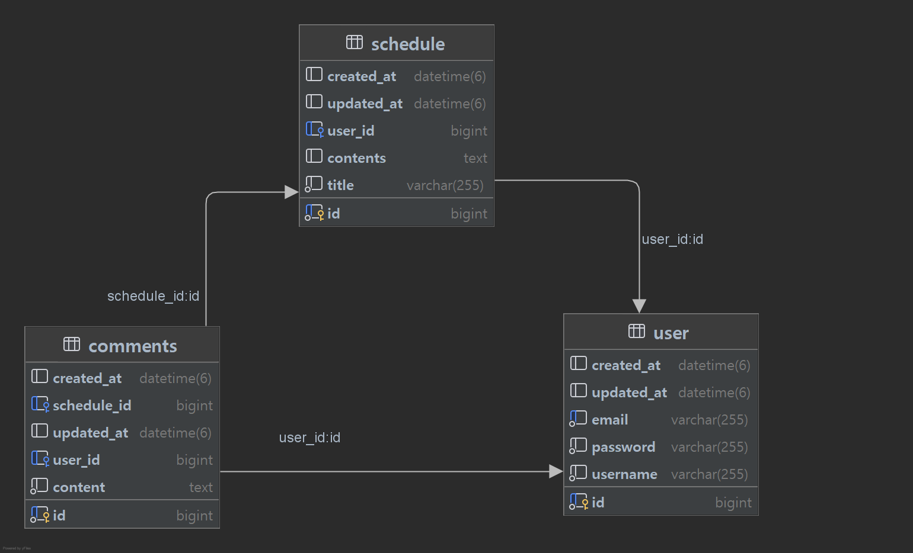

# Calendar

## :mortar_board: 프로젝트 소개

java 기반으로 만들어진 일정 관리 프로그램 입니다.

회원 가입을 하고 로그인 해서 등록된 회원의 정보를 조회, 수정, 삭제합니다.

일정 전체를 조회 하거나 로그인 하여 새로운 일정 등록, 선택된 일정을 단일 조회, 수정, 삭제합니다.

특정 일정의 댓글을 조회하고 로그인 후 댓글을 등록하고 수정, 삭제 합니다.

## :page_with_curl:주요 기능

- 회원 가입을 합니다.

- 가입된 회원의 정보를 조회, 수정 삭제 합니다.

- 로그인 또는 로그아웃을 합니다.

- 일정 목록을 조회합니다.

- 선택한 일정을 단일 조회할 수 있습니다.

- 일정 내용, 작성자를 입력하여 새로운 일정을 등록할 수 있습니다.

- 선택한 일정을 수정할 수 있습니다. 이 때, 수정된 날짜도 출력합니다.

- 선택한 일정을 삭제할 수 있습니다.

- 특정 일정에 댓글을 작성합니다. 또는 수정, 삭제 할 수 있습니다.

- 특정 일정에 달린 댓글만 조회합니다.

##  ERD

##  API 명세서
[api 명세서](https://documenter.getpostman.com/view/43159028/2sB2cU9Mna)

## :wrench:개발 환경
- java 17

- IntelliJ IDEA

- Spring Boot 3.4.4

- Mysql

## :alarm_clock:개발 기간

2025.03.27~2025.04.04

